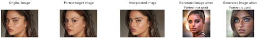

Portect
=======
Portrait identity protection against DreamBooth
------------------------------------------------



* Original photo by Tal Abudi, CC BY-SA 3.0 <https://creativecommons.org/licenses/by-sa/3.0>, via Wikimedia Commons
* The face in the target photo was originally taken from the CelebA dataset 

How to protect your images:
---------------------------
First, download and set up the repo:
```
git clone https://github.com/TheSolY/Portect.git
cd Portectgit status
```
Install the minimal requirements:
```
pip install -r requirements_minimal.txt
```
Download the necessary models from 
https://huggingface.co/ezioruan/inswapper_128.onnx/tree/main

Run the script
```
python cloak_images.py --image_dir=<path to your images>
```

Your images are ready to use in the output folder!

Acknowledgement:
----------------
This implementation relies on the InsightFace and CelebA.
